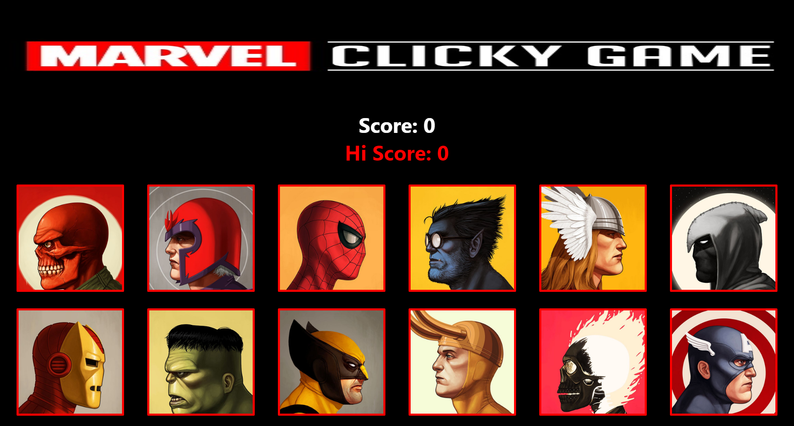

<!-- PROJECT LOGO -->
<br />
<p align="center">
  <a>
    
  </a>
</p>


<!-- TABLE OF CONTENTS -->
## Table of Contents

* [About the Project](#about-the-project)
  * [Built With](#built-with)
* [Getting Started](#getting-started)
  * [Prerequisites](#prerequisites)
  * [Installation](#installation)
* [Usage](#usage)
* [Contact](#contact)

<!-- ABOUT THE PROJECT -->
## About The Project


Marvel clicky-game is a memory type game where a user will have to remember the last character they clicked.

[Link to deployed project](https://jcabs14.github.io/clicky-game/)

### Built With
* [Javascript](https://www.javascript.com/)
* [React](https://reactjs.org/)
* [Node.js](https://nodejs.org/en/)

<!-- GETTING STARTED -->
## Getting Started

### Prerequisites

Have Visual Studio Code installed or similar application

### Installation

In your favorite terminal do the following:

1. Clone the repo
```sh
git clone https://github.com/Jcabs14/clicky-game
```
2. Install NPM packages
```sh
npm install
```
3. Starting project locally
```sh
npm start (once you are in the projects folder)
```
<!-- USAGE EXAMPLES -->
## Usage

The game is very simple to play, you start by clicking a character image and the images will randomize after that.
You must then find and click a different image everytime you click another character image.
The goal is to get a score of 12!

<!-- CONTACT -->
## Contact

Jared Cabanilla

jcabanilla@gmail.com

Project Link: [https://github.com/Jcabs14/clicky-game](https://github.com/Jcabs14/clicky-game)


